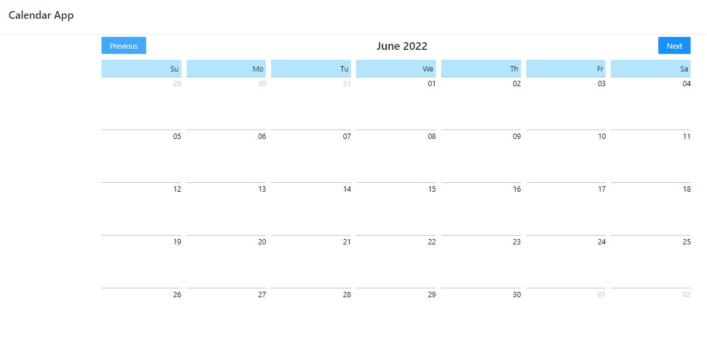
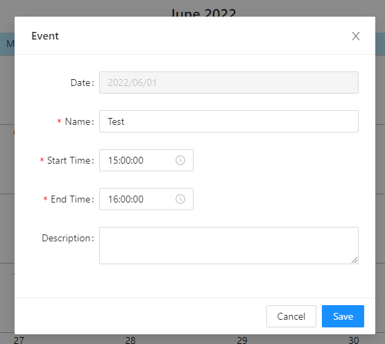
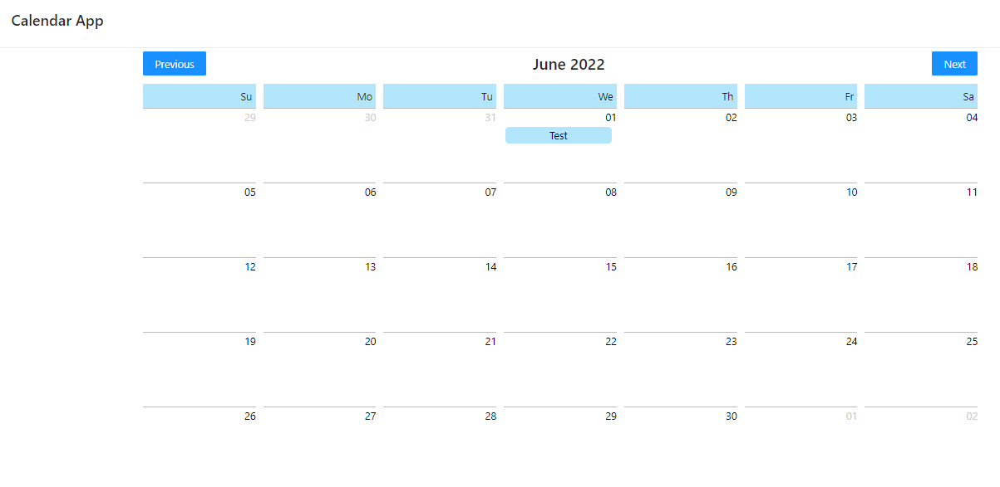

1. Create a calendar that shows current months and all days
   Use moment.js
2. Create a form to create events
   - Name of the event
   - Date (Readonly)
   - Start and end time
   - Optional description
3. After clicking any date in the calendar, open the form to create an event
4. After saving the event, display it inside the calendar selected day

